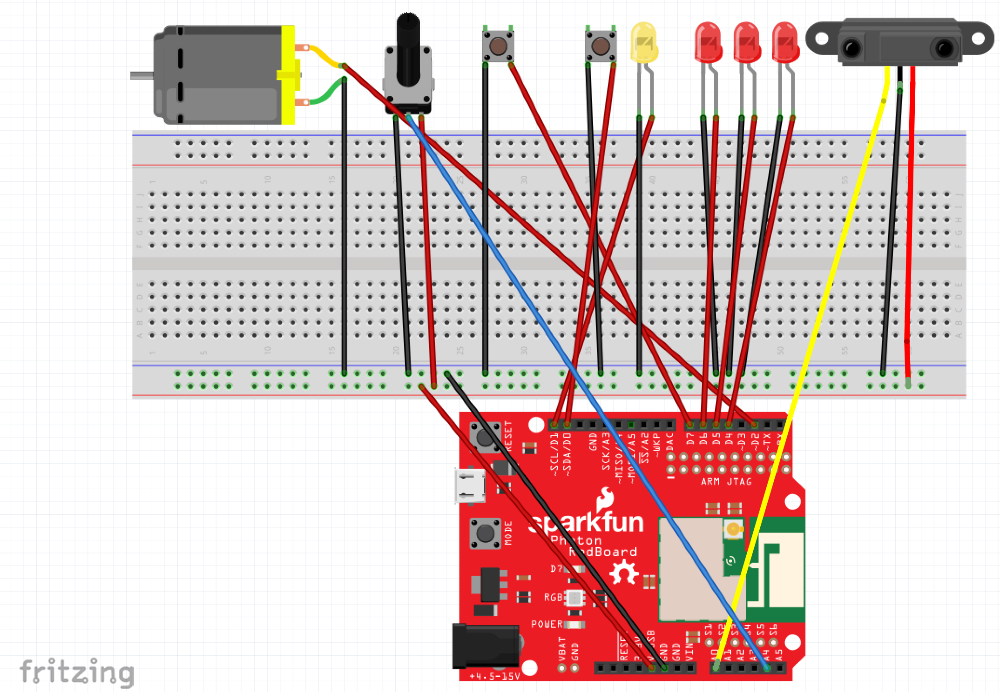
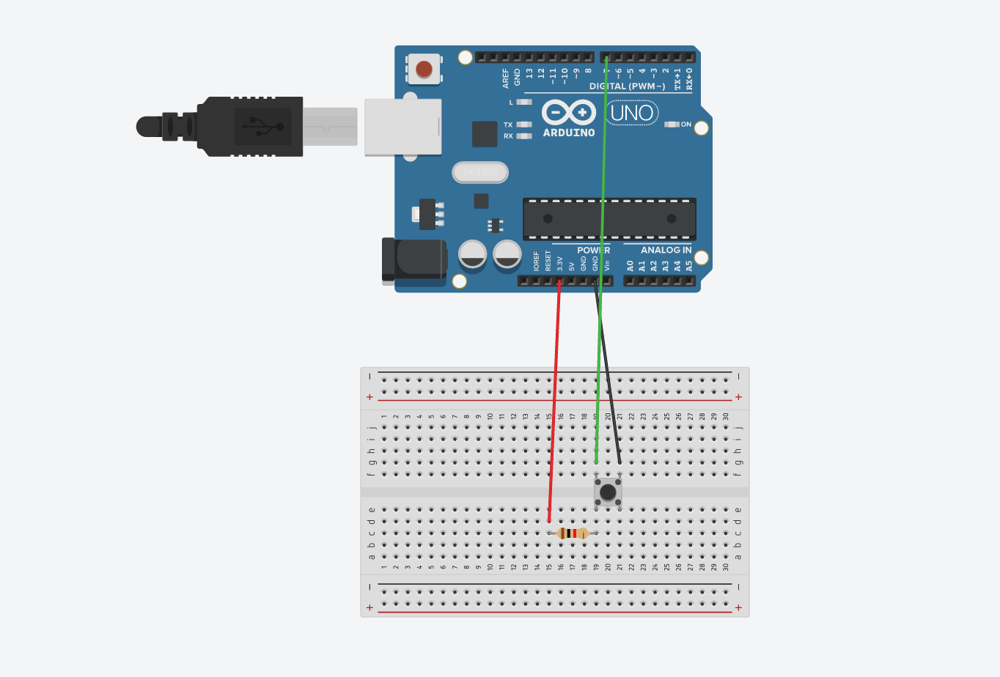
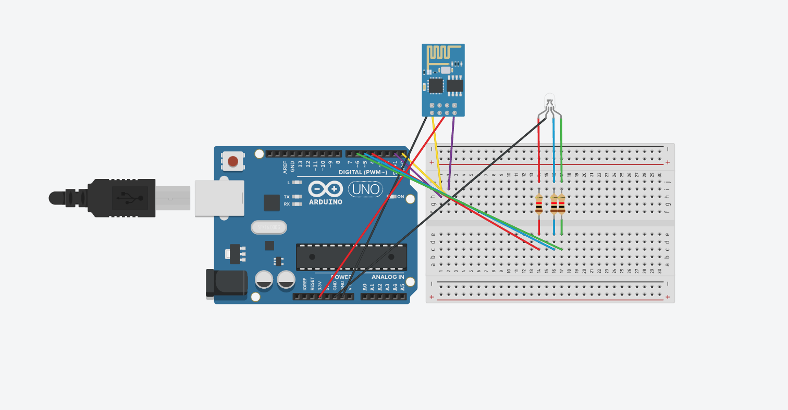
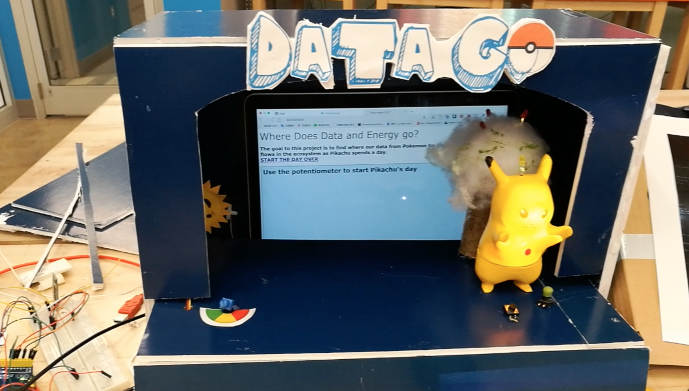

# Final Project - Physical Computing and the Internet of Things


*Name:*  Yuchen Zhao  

*Date:* 12/12/2017

## Project:   "Data Go Energy Go!"-- An Interactive Mini Stage 

Our project is an entertaining and educational tool to help user understand how data flow when they play the PokemonGo 
game. We used a storytelling way to visualize the process on an interactive stage.

This project's objective is to highlight Pokemon Go's data privacy issue. In order to help people effectively learn the information, a story of Pikachu’s ecosystem is included. Pikachu is a crucial part of Pokemon Go and it is used as an object to criticize Pokemon Go’s privacy policies. 

### :star2::fireworks::dvd: [VIDEO DEMO HERE](https://youtu.be/x2A9smFMEuY)  :dvd::fireworks::star2:


### Detailed Project Description

**Explain the "what" of your project:**  
- What is it?   
  "DATA GO!" is a name based on "PokemonGo". It is a project that help people understand how data flows in the PokemonGo game. For better understanding, we made an interactive mini stage as the format to show the content and also use "Energy flow" in our daily life as an analogy to make the abstract concept of data more concrete. 
  
- What does it do?   
  In order to make this tool more attractive, we have considered two ways to improve its entertaining and educational property: 
1. For the content, we used the “Energy flow” to explain “Data flow”.
“Energy flow” means how energy circulates in our ecosystem, such as how energy produces, transports, consumes, and re-produces as a circle. Since it happens every day and everywhere, we believe this concept would be easier for people to accept and understand. And also this energy flow process is easier to visualize. 
Then we found that the process of energy flow is similar with the process of data flow, so we decide to use this to explain how data flows. For example, at the beginning of energy flow, the sun provides energy to every life on earth, which is similar to the process of data flow: when people input their personal information, those information could be regarded as a kind of source for the data circulation. Then back to the energy process, energy is produced by sun and then transmits to the plants, then plants are eaten by other creatures, creatures now obtain this energy and then using other ways to consume and eliminate them from their body. Then an energy circle ends. Similarly, for the data flow, when users input their personal information, the game company collects those data and shares them with some outside entities, then those third parties use the information and provide some related services and then those information would also be continued to transmit to other entities. And then a potential threat comes—your personal information spreads everywhere. 
There are two diagrams to show those two diagrams:

Energy Flow: sun produces the energy--energy transmits to the tree, apples are red--Pikachu eats the apple(Pikachu has the 
             energy)-- Pikachu makes flash (consume the energy)

Data Flow:   User inputs personal information--PokemonGo company collects the information--share those data to other outside 
             companies--those comapanies use these data and then share them again

2. For the format:
   1) we used an interactive mini stage to visualize the process of energy flow (this part will be detailed descripted in the “technical” part)
   2) used a storytelling way to explain the process (Pikachu is our main character)
     
**Explain the "why" of your project:**
What problem is it responding to?  What issue is it engaging?   
1. Data Flow is a kind of abstract concept to most people, and also when users play a game, they will be unconscious about how their personal information goes. We hope through our project, people could understand how their personal information transmit and start to consider how to protect them.
As is shown in our last page of HTML, Pikachu complained that why he loves apple but received many advertisement of Apple device product. This is a joke, but I think everyone once met such situation: some ads appear on our computer according to our searching history or other data released by some companies. Therefore, we want to arise people’s realization about the data security and protection.

2. The interactive stage 
We made an interactive stage to visualize the process of energy flow since we think this process is abstract and hard to understand, so we use Pikachu as the main character to act a story about how energy goes in our daily life. 

### Technical Description

**Explain the "how" of your project.**
- What are the hardware components?  
  •	Boards × 2  (Arduino + Photon)
  •	Sensors: LED × 4 ; RGB LED×1; Potentiometer × 1 ; Servo Motor × 1;  
             Distance sensor ×1; Button × 3; Bluetooth module × 1 ; 
             
  •	Other device: Laptop screen; Mini projector; Mobile Phone
  •	Handcraft Material: foam board; paper; 

- What are the software components?  
  •	Particle IDE
  •	Arduino IDE
  •	Processing
  •	HTML, JavaScript

- How do they interact with each other? 
  There are three parts in the stage:
  
  Part1: the energy circle with HTML: 
  - Step1: Potentiometer (0-500 degree)-Sun rises (servo motor rotates accordingly)-HTML(page1) pops up; 
 
  - Step2: Distance sensor detects the sun and apple tree lights-HTML(page2) pops up;
  
  - Step3: Press red button on Pikachu (which means Pikachu eat the apple)—HTML(page3) pops up;
  
  - Step4: Press the green button (which means you feed Pikachu a pepper)—the yellow light on Pikachu’s head flashes (which means Pikachu is angry so flashing to against)--HTML(page4)pops up;
  
  - Step5: Potentiometer (500-1000 degree)-Sun goes down, HTML(page5)pops up;
            
   Part2: change facial expression
            This is a fashion element on the stage, user could press button on the stage to switch 
            the facial expression of Pikachu which seems like you are playing with it. (I used a 
            projector to project image on Pikachu’s face) (Processing communicates with Arduino)

  Part3: Bluetooth control the RGB Led
            This is another fashion element; I hope user could use their own mobile to interact 
            with the logo of our stage.
            There I installed a RGB Led on the ball of logo, user could download an app called 
            BT_LED_Controller, then connect with the Bluetooth called H0-C6, and they can 
            control the Led’s color.


#### Hardware Wiring Diagram

**Energy Flow Circle**

**Projector**

**Bluetooth Control**

#### Code

**Data Flow Circle in Particle IDE** 
or download it from https://go.particle.io/shared_apps/5a2b8aa70b875f2feb000460
```c++
// Data Flow Circle in Particle IDE or download it from https://go.particle.io/shared_apps/5a2b8aa70b875f2feb000460
// This #include statement was automatically added by the IDE.
#include "SharpIR.h"
#include <SharpIR.h>
#define ir A0
#define model 1080
#include <math.h> 

// Servo motor(Sun comes up)
Servo myservo;  // create servo object to control a servo
int potpin = A4;  // A4 analog pin used to connect the potentiometer
int val;    // variable to read the value from the analog pin
int mappedVal; // mapped value for servo

// InfraIR(Sun to Apple)
int sensorPin = A0; //Anologue
SharpIR SharpIR(ir, model);
float reading;
int dist_cm;

// ButtonLED(Pikachu eats Apple)
int buttonPin1 = D7;

// ButtonLED(Thunder bolt)
int ledPin = D1;
int buttonPin2 = D0;//pepper button

// HTML(On Going)
int page = 1; //starts with 1.html

void setup(){
    Serial.begin(9600);
// HTML
    Particle.variable("page", page);
// Servo motor  
    myservo.attach(D2);  // attaches the servo on D2 to the servo object
// InfraIR
   for(int i=4; i<7; i++){
        pinMode(i, OUTPUT); //D4, D5, D6
    }
// ButtonLED(Pikachu eats Apple)
    pinMode(buttonPin1, INPUT_PULLUP);

// ButtonLED(Thunder bolt)
  pinMode(buttonPin2, INPUT_PULLUP); 
  pinMode(ledPin, OUTPUT); 
  pinMode(potpin, INPUT);
}


void loop()
{
    Serial.print("Page: ");
    Serial.println(page);
    // servo motor
    val = analogRead(potpin);            // reads the value of the potentiometer (value between 0 and 1023)
    Serial.println(val);
    mappedVal = map(val, 0, 4095, 0, 180);     // scale it to use it with the servo (value between 0 and 180)
    myservo.write(mappedVal);                  // sets the servo position according to the scaled value
    delay(15);                           // waits for the servo to get there

    if(val >= 5  && val < 500)
    {
        page=2;//html
    } 
    if(val >= 500 && val < 1000)
    {
        page=3;//html
    } 
    // InfraIR
    reading = analogRead(sensorPin); //read the sensorPin
    int dist_cm = SharpIR.distance();  
        
    if(dist_cm>=0 && dist_cm<11)
    {
        for(int i=4; i<7; i++)
        {
            digitalWrite(i, HIGH); //all lights are ON 
        }
        Particle.publish("light_status", "less than 10cm");
    }
    else
    {
        for(int i=4; i<7; i++)
        {
            digitalWrite(i, LOW); //D4, D5, D6 is OFF
        }
    }
    delay(50);
    
    //Button change page
    int buttonState1 = digitalRead(buttonPin1);
    if(buttonState1 == LOW)
    {
        page=4; //html
    }
    
    //ButtonLED (thunder)
    int buttonState2 = digitalRead(buttonPin2);
    if(buttonState2 == LOW)
    {
        digitalWrite(ledPin, HIGH);
        page=5; //html
    }else
    {
        digitalWrite(ledPin, LOW);
    }
    
    //potentionmeter state sun down
    if(val>=3000)    
    {
        page=6; //html
    }
}

```
**Change Facial expression**
(Arduio communicate with processing)
```
// Arduio Part
int switchPin = 7;
int LEDPin = 13;

void setup() {
  pinMode (switchPin,INPUT);
  pinMode (LEDPin,OUTPUT);
  Serial.begin(9600);
}

void loop() {
  if (digitalRead(switchPin) == HIGH){
    Serial.write(2);
    digitalWrite(LEDPin,HIGH);
    }else{
    Serial.write(1);
    digitalWrite(LEDPin, LOW);
      }
    delay(100);

}

```
```
// Processing part
import processing.serial.*;
Serial port;
int val = 0;
int oldval = 0;
int numFrames = 5;
int frame = 0;
PImage[] images = new PImage[numFrames];

void setup()
{
  size(1440,2000);
  
  images[0] = loadImage("/Users/yuchen/Box Sync/Home Folder yz330/2017-FALL-SYNC/Physical Computing/8-Final Project/Some Tests/Arduino_processing_switch_image_test/processing_switch_image_test/expression1.jpg");
  images[1] = loadImage("/Users/yuchen/Box Sync/Home Folder yz330/2017-FALL-SYNC/Physical Computing/8-Final Project/Some Tests/Arduino_processing_switch_image_test/processing_switch_image_test/expression2.jpg");
  images[2] = loadImage("/Users/yuchen/Box Sync/Home Folder yz330/2017-FALL-SYNC/Physical Computing/8-Final Project/Some Tests/Arduino_processing_switch_image_test/processing_switch_image_test/expression3.jpg");
  images[3] = loadImage("/Users/yuchen/Box Sync/Home Folder yz330/2017-FALL-SYNC/Physical Computing/8-Final Project/Some Tests/Arduino_processing_switch_image_test/processing_switch_image_test/expression4.jpg");
  images[4] = loadImage("/Users/yuchen/Box Sync/Home Folder yz330/2017-FALL-SYNC/Physical Computing/8-Final Project/Some Tests/Arduino_processing_switch_image_test/processing_switch_image_test/expression5.jpg");
  
  println(Serial.list());
  port = new Serial(this,Serial.list()[1],9600);
  
}
void draw()
{
  if(0 < port.available()){
    val = port.read();
  }
  if (val != oldval && val == 2){
    if (frame<numFrames-1){
    frame = (frame+1);
    }else {
    frame = 0;
    }
    }
    image(images[frame],0,0);
    oldval = val;
}
```
**Bluetooth control**
```
// notice upload code FIRST, then plug in RX and TX. AND RX should connect with TX, TX connect with RX.
#include <SoftwareSerial.h>

SoftwareSerial BLU(0,1);

#define redPin 6
#define greenPin 3
#define bluePin 5

void setup()
{
  //Serial setup
  Serial.begin(9600);
  Serial.println("-= HC-06 Bluetooth RGB LED =-");
  BLU.begin(9600);
  BLU.println("-= HC-06 Bluetooth RGB LED =-");
 
  pinMode(4, OUTPUT);
  pinMode(redPin, OUTPUT);
  pinMode(greenPin, OUTPUT);
  pinMode(bluePin, OUTPUT);
  digitalWrite(4,HIGH);

  setColor(255, 0, 0);
  delay(500);
  setColor(0, 255, 0);
  delay(500);
  setColor(0, 0, 255);
  delay(500);
  setColor(255, 255, 255);
}

void loop()
{
  while (BLU.available() > 0)
  {
    int redInt = BLU.parseInt();
    int greenInt = BLU.parseInt();
    int blueInt = BLU.parseInt();

    redInt = constrain(redInt, 0, 255);
    greenInt = constrain(greenInt, 0, 255);
    blueInt = constrain(blueInt, 0, 255);

    if (BLU.available() > 0)
    {
      setColor(redInt, greenInt, blueInt);

      Serial.print("Red: ");
      Serial.print(redInt);
      Serial.print(" Green: ");
      Serial.print(greenInt);
      Serial.print(" Blue: ");
      Serial.print(blueInt);
      Serial.println();

      BLU.flush();
    }
  }
}

void setColor(int red, int green, int blue)
{
  analogWrite(redPin, red);
  analogWrite(greenPin, green);
  analogWrite(bluePin, blue);
}
```


### Design / Form

Explain the device's form
A formboard-made stage with some elements such as 3D printing tree, Pikachu, etc.

The aesthetic choices made and how they relate to the concept/function the device is intended to engage？
1. The overall design: The reason why I made a stage is that I want to add as many as possible elements and techniques I had learned before. So stage might be a good form to combine and mix everything. In my interactive stage: it shows a story; uses different sensors to push forward the story; IoT function; Projection Mapping; Bluetooth Control;
2. Visual Identity: fellow with the PokemonGo game. Like the Logo design, I referred to  the PokemonGo’s logo, used a similar fonts and added some elements like the elf ball to help users to build an impression based on the PokemonGo.
3. The stage’s color: I used a dark-blue color to design the whole stage since the other elements on the stage will be bright, and also I need a dark inside to make sure the projector has a better effect.

< include photos of your device >


### Evaluation / Reflection

-What is your own evaluation of your project?

* Advantage: 
1. we have tried many kinds of sensors and use a story to connect them, this is 
    creative
2. Covered as many as possible knowledge from class(IoT, sensor, 3d printing)
3. Added some fashion elements
4. cared about the overall design (the color, the form, the size,etc)

* Disadvantage:
1. need more fashion elements
2. need to make the HTML page more pretty
3. only use the basic function of sensor
4. need to combine the main story and fashion elements more tightly

-What did you learn through this project?  
1. Learn how to connect sensor and HTML 
2. How to let Arduino communicate with processing
3. Try projection mapping on a 3D object
4. use Bluetooth to control sensor
5. How to manage time well
6. How to face some unexpected accident 
7. How to cooperate with others
8. Handicraft is harder than imaged 

-What would you do differently in the future? 
1. add more fashion elements
2. make HTML more pretty 
3. make the story more attractive and instructive 

